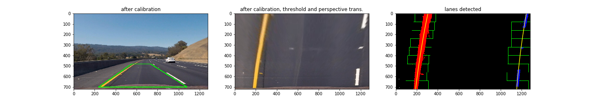

# Project: Advanced Lane Finding

## 1. Overview
The purpose of this project is to build a pipeline for identifying lane boundaries
in videos of roads captured by a camera attached to a vehicle. We apply
our pipeline to several images and videos to check its performance.
The Python code for implementing our pipeline is given in `project.ipynb`.
We arranged such that the sections in this writeup match with those in `project.ipynb`.
For example, the code for the distortion correction explained the subsection 3.2.
of this writeup is given in the subsection 3.2. of `project.ipynb`.

## 2. Camera Calibration and Distortion Correction
Before building up the pipeline, we carried out the calibration of the camera
attached to the vehicle. For this purpose, we used several images of a chess
board (with `9x6` internal edges) in the folder `camera_cal`. We note that
the size of the input images (and videos) used for this project is `1280x720`
with three channels (i.e. color images). The steps for the camera calibration
are as follows:

- We first converted the images to grayscale and then applied
`findChessboardCorners()` function in the OpenCV library
to detect the inner edges in the images.
- By feeding the locations of the inner edges into `calibrateCamera()`
(also in the OpenCV library), we obtained the calibration matrix
and distortion coefficients. The calibration matrix and distortion coefficients
are stored in the variables `mtx` and `dist` in `project.ipynb` for later use.

The undistorted images can be obtained by using `undistort()` function
of the OpenCV library with the calibration matrix and distortion coefficients.
The following is an example of the chessboard images
before and after the calibration:

## 3. Pipeline for Lane Finding
In this part, we explain the detail of our pipeline for lane finding.
The whole structure of the pipeline is summarized in the Figure below:

In the following subsections, we explain each step in the pipeline in detail.
We also show how each step of our pipeline works by showing how some
image example changes through that step.   

### 3.1. Distortion Correction
As mentioned above, in this project, we uses `1280x720` color images/videos
of the roads as inputs and find the lane boundaries in them.
The first step of the pipeline is to undistort the images
by using `undistort()` function with the calibration matrix and distortion coefficients
obtained by calibrating the camera in Section 2.   
An example of the distorted images of a road is shown below:

### 3.2. Gradient and Color Thresholding
The next step we need to do for lane finding is to read an undistorted image
of the road and then create a grayscale binary image which captures the location
of lane boundaries as white lines in a black background.
For this purpose, we use a combination of the gradient threshold
and color threshold as follows (for the very details of the parameters, please
refer to `project.ipynb`):

- **Gradient Threshold**: We applied the Sobel operators to compute gradients
in the horizontal/vertical direction and then applied the thresholds to
the magnitude and the direction of the gradient. We then generated
a binary image such that when a given pixel is detected by applying
both magnitude and direction thresholds, then this pixel is regarded as
being detected (i.e. colored in white).
- **Color Threshold**: To apply the color threshold, we first convert the
color image in RGB color space to the one in HLS/YCrCb/LAB color space.
Then a given pixel is regarded as being detected when the pixel is
detected by the thresholding i or/and ii defined below:
  1. For HLS color space, we extracted S-channel and then applied a threshold.
  For YCrCb color space, we extracted Y-channel and then applied a threshold.
  Then a given pixel is regarded as being detected when the pixel is detected
  by the both thresholdings.
  2. For LAB color space, we considered L-channel and B-channel. Then
  a give pixel is regarded as being detected when the pixel is detected
  by either L-channel or B-channel thresholding or both.  
- **Combining Results**: To create a final grayscale binary image, we simply combined
the results from the gradient threshold and color threshold, i.e. a pixel
detected either by the gradient threshold or color threshold is regarded as
being detected.

This pipeline for the thresholding is implemented as a function `pipeline_thresh()`
in `project.ipynb`.
The images below display how our thresholding generates binary images:

Here in the colored images in the middle column, the blue/green colored pixels
are those detected by color/gradient thresholding. The images in the right column
are grayscale binary images obtained by combining the color and gradient thresholdings.
We note that third example (3rd row) is an image captured from the optional challenge video
`challenge_video.mp4`.
The only reason for combining the gradient threshold above is that the gradient
threshold detects (though very weakly as in the 3rd example)
the yellow colored boundary lanes in the shade. This helps to find lanes
when we apply our pipeline to `challenge_video.mp4`.
(In fact, if one considers `project_video.mp4` only, the pipeline
without the gradient thresholding works well.)

### 3.3. Perspective Transformation
The next step is to apply the perspective transformation to the binary images
for obtaining bird-eye view images of the lanes (i.e. how the lanes look like when they
are seen from the right above). For this purpose,

- we first chose a trapezoid-shape region
in the thresholded binary image as a source and set a rectangular region
as a destination of the perspective transformation. The source is chosen
such that left and right lane lines become parallel in the bird-eye view images.
The concrete choice of
the source and the destination is given as (here the four points describe the
location of the edges)
  - **Source**: (552, 480), (732, 480), (1080, 700), (235, 700)
  - **Destination**: (160, 0), (1120, 0), (1120, 720), (160, 720)

- Then, we used `getPerspectiveTransform()` function in the OpenCV library to compute
the perspective transformation matrix `M` as well as its inverse `Minv`. The inverse
matrix will be used when we map back to the undistorted images after the lane finding
is completed.

Examples of the warped images obtained by applying the perspective
transformation are given below (note that `warpPerspective()` function in OpenCV
library with the computed perspective transformation matrix generates a warped image):

Here the green squares in the left images are the sources and
those in the middle images are the destinations defined for the perspective transformation.

### 3.4. Lane Detection and Fitting
Once a warped image (with lane boundaries contained) is created by applying
the perspective transformation, the next step is to identify the lane boundaries
in the warped image. To do this, we took the following steps:

1. We first focused on the bottom half of the warped image and
created a histogram by counting the number of white pixels at each fixed horizontal
x-coordinate column. The highest peak in the left/right half of the histogram
is identified as the location of the left/right lane boundary at the bottom of
the image.
2. We next considered a window centered (in the horizontal direction, with an appropriate
height) at the location of the detected left/right lane boundary in the first step.
We counted the number of white pixels in the window, and,
  - if the the number is greater than a certain threshold, we updated the location
    of the lane boundary at this y-coordinate (= the y-coordinate of the center
    point of the window) to the mean value of the x-coordinates of the white pixels
    inside the window;
  - otherwise, the x-coordinate of the lane detected in the previous step is regarded as
    the x-coordinate of the lane at this y-coordinate point.
3. We started with the locations of the lane boundaries identified in the previous step,
  considered another window (centered at the x-coordinate of the detected boundary in the previous
  step and located just above the previous window) and do the same thing as the previous step.
  We then repeated this until the window reaches the top of the image.
- We in the end fit the detected left/right lane boundary points with a second order polynomial,
  i.e. `x = f(y) = A y^2 + By + C`.

This step is implemented as a function `lane_detect()`.
The result of the lane boundary detection is shown through several example images below:

The green boxes in the right images are windows used for the lane boundary detection
and fitted lane boundary lines are denoted in yellow there.  

### 3.5. Curvature of Lane and Deviation from Center

Once the lanes are detected, we computed the curvature radius
of the lanes as well as how much the vehicle deviates
from the center of the lane. We note that one pixel in the x-direction (resp. y-direction)
corresponds to `3.7/700 meter` (resp. `30/720 meter`). We used this to
compute the curvature radius of the lane and the deviation from the center
of the lane in the unit of meter. The detail of the computation of these
two quantities goes as follows:  

- **Curvature Radius of Lane**: Since the left/right lane line is fitted with the second order
polynomial of the form x(y) = A y^2 + By + C, the curvature radius R of each lane line can be
computed by using the formula: `R = (1 + (x')^2)^{3/2}/|x''| = (1+(2Ay+B)^2)^{3/2}/|2A|`
where x' and x'' respectively are 1st and 2nd order derivatives of x with respect to y. We computed the curvature radii for the left and right lanes separately,
and then regarded the average of them as the curvature radius of the lane itself.

- **Vehicle Location**: The mid point of the lane at the bottom of the image
can be computed as the average of the locations of the the left and right lane boundaries
at the bottom of the image. Then, the deviation of the vehicle from the center of the lane
can be computed by subtracting the x-coordinate of the mid point of the image
from the x-coordinate of the mid point of the detected lane at the bottom of the image.
We note that here we assumed that the camera is attached to the center of the vehicle.

The computation of these two quantities are done by the function
`curvature_dev_center()`.

### 3.6. Inverse Perspective Transformation (Undistorted Image with Detected Lane)
Once the lane detection is completed (on the warped image), we mapped it back with
the inverse perspective transformation, and then combined with the colored
undistorted image of the road. The left and right lane boundaries are
displayed in red and blue, respectively, and the lane between the boundaries
is colored in green. We have also added to the output image
the information of the curvature radius of the lane and the deviation of the vehicle
from the center of the lane.
Examples of the undistorted images with the detected lane are given below:

### 3.7. Pipeline for Image
By combining the above results,
our pipeline for lane finding is implemented as a function `pipeline_image()`
for processing images in `project.ipynb`.

### 3.8. Pipeline for Video: Extra/Modification
As can be seen above, our pipeline works well for the images.
Now we consider the case of the video. The video is made of a series of images.
An image at a given time frame and the one in the next time frame are
very similar normally. Thus during a short time duration, the location of the lane
and its boundaries must not change drastically. By noticing this fact, we modified
several points in the steps of the pipeline mentioned above as follows:

- When processing a video, after the lane boundaries is detected in a previous time frame,
in the next frame, there is no need to search for the lane boundaries
from scratch by drawing a histogram as in the function `lane_detect()`.
We can use the location of the lane boundaries detected in the previous time frame
as the starting point, and then do the window search around it.
We have implemented another function `lane_detect_update()` to implement this.
When the lane boundaries are detected at a given time frame,
`lane_detect_update()` is used in the next time frame, instead of `lane_detect()`.
- Since the lane do not move a lot during a short time interval,
it is better to take into account the history of the location of the lane boundaries.
More precisely, we saved the information of the detected lane boundaries
in the last 20 time frames. We then evaluated the location of the lane boundaries
as the average of the 20 time frames. This modification makes our lane finding
procedure to be more stable.
- In case the detection of the lane boundaries failed or badly detected/fitted at
a certain time frame,
we did not update and then simply regard the lane boundaries detected in the previous
time frame as the ones for the current time frame. More concretely, when the
curvature of the lane and/or the deviation of the vehicle from the center of the lane
computed in a given time frame are very different from those in the
previous time frame, we did not update the location of the lane boundaries.

These modifications from the pipeline for a fixed image
are implemented in `pipeline_video()`.

## 4. Performance

Now we apply our pipeline `pipeline_video()` to some videos to check its performance.
The result can be seen in the following videos (these are also stored in the folder `videos`):

- [**Project Video**](https://www.youtube.com/watch?v=-RL1_V918zI)
- [**Challenge Video**](https://www.youtube.com/watch?v=YHKh9maxC10)

<!-- - **Harder Challenge Video**: [Original](videos/...) , [With Lane Detected](videos/...) -->

This shows that our pipeline above works for lane finding.

## 5. Summary and Discussion
In this project, we built a pipeline for finding lanes in images and videos of roads.
Our pipeline finds the lanes well. Here we comment on some difficulties we encountered
in the course of building the above pipeline.
We also discuss some potential improvements:

- One of the difficulties we faced was to detect the yellow colored lane boundary
in the shade. This situation shows up in the challenge video. We used the gradient
thresholding to detect this, but, since the gradient thresholding also detects
other irrelevant lines such as the black lines in the road such as the line of oils and
boundary of two different surfaces, we have to impose a very strict threshold.
(In this pipeline we used a combination of the thresholdings on the magnitude
and the direction of the gradient. We also tried the thresholding on the
x-component/y-component of the gradient but this detected a lot of irrelevant lines
and thus we did not use it for our pipeline.)
Although we have imposed a very strict threshold, still this detects some irrelevant
lines (as can be seen at the early point of the challenge video). It is ideal
if there is a way to detect the yellow colored lane boundary in the shade
by using other thresholdings, without detecting irrelevant lines.

- In our pipeline, when updating the detected lane boundaries, we required that
the vehicle should not deviate from the center of the lane too much
during a short time interval. However, when a vehicle changes the lane,
for example, the deviation is large. We need to take into account this situation
to build a better pipeline.

- Another interesting realistic situation is when a vehicle needs to go
on the right side of a wide road without a separation line in the middle (if the
vehicle did not go on the right side, then it would crash with other vehicle
going in the opposite direction). In such a situation, the vehicle must judge
in some way that it should stay on the right side of the road. This situation
is obviously not taken into account in the above pipeline. Further improvement is needed.
